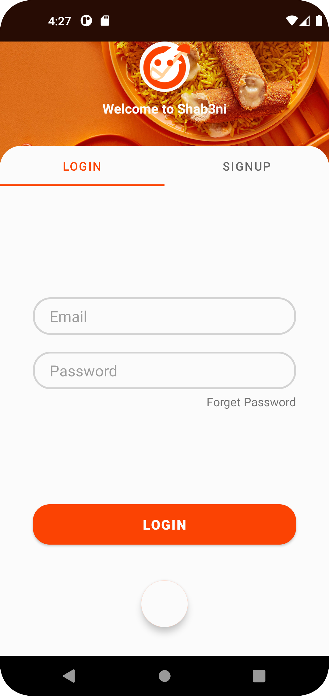
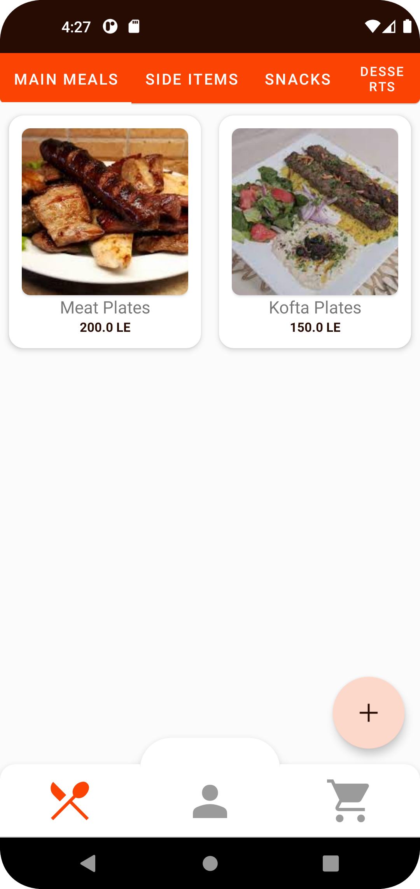
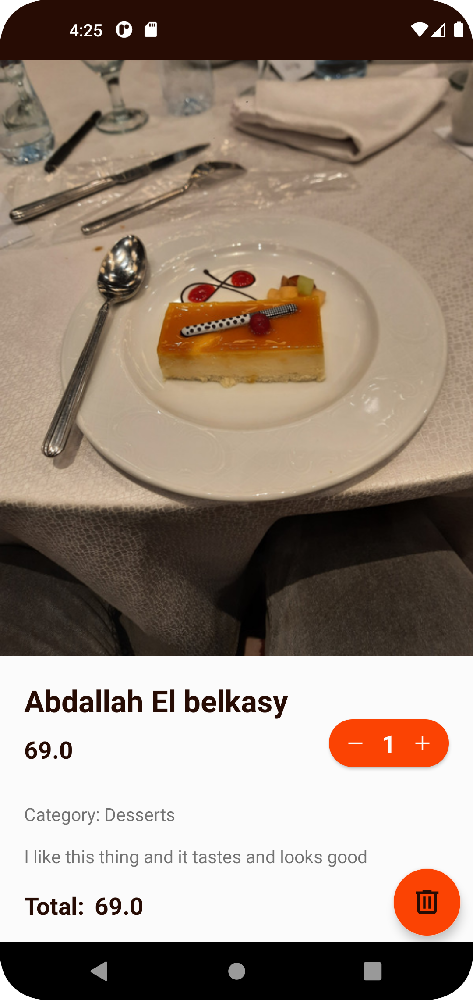
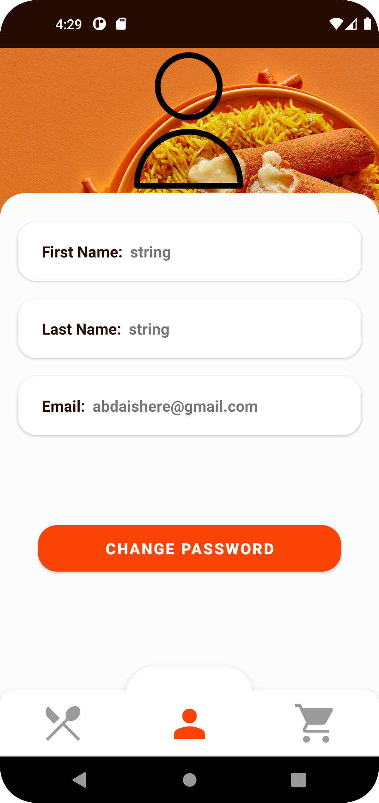
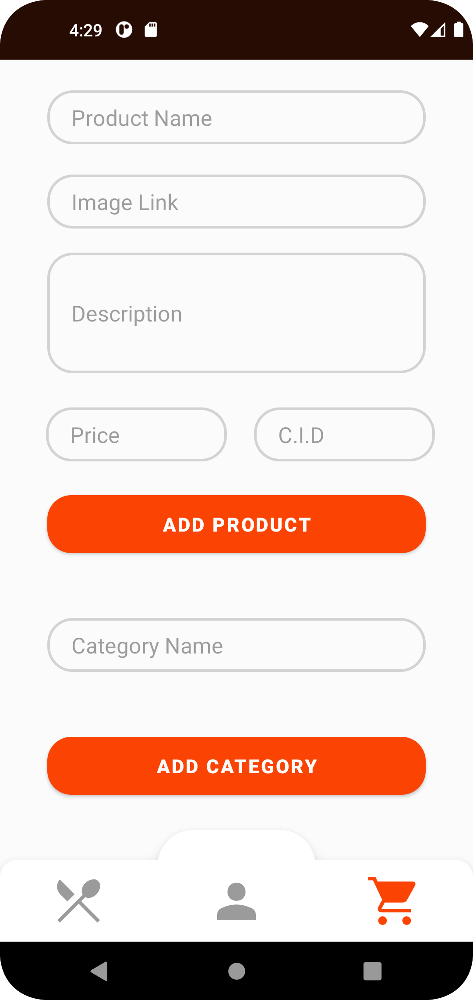

# Shab3ni Food Ordering App

Shab3ni is a food ordering application for Android devices, designed to make it easier for users to order food online from their favorite restaurants. With Shab3ni, users can browse menus, place orders, and pay for their meals all from their mobile devices. The app also includes features such as order tracking and order history, making it a convenient and user-friendly solution for ordering food online.

Shab3ni is an App Made For Food Orders

 

  

## Features

- **Easy Ordering**: The app provides an intuitive interface that allows users to quickly browse through restaurant menus, add items to their cart, and place orders with just a few taps.
- **Order History**: The app also maintains a history of past orders, allowing users to easily reorder their favorite meals.
- **Restaurant Rating**: Users can rate their experience with a restaurant, helping others make informed decisions when choosing where to order from.
- **Push Notifications**: The app sends push notifications to users to keep them informed about the status of their orders.

## Technologies Used

- **Java**: The app is written in Java, a popular programming language for Android development.
- **Android Studio**: Android Studio is the official IDE for Android app development, and was used to build and test the app.
- **Firebase**: Firebase is a mobile and web application development platform, used to handle user authentication and backend functionality in the app.

## Getting Started

To get started with the Shab3ni app, simply download it and build the app. Then you can start browsing through restaurant menus and placing orders.

## License

Shab3ni is licensed under the [MIT License](https://opensource.org/licenses/MIT). Feel free to use, modify, and distribute the code as you see fit.
